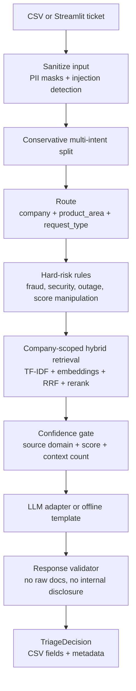
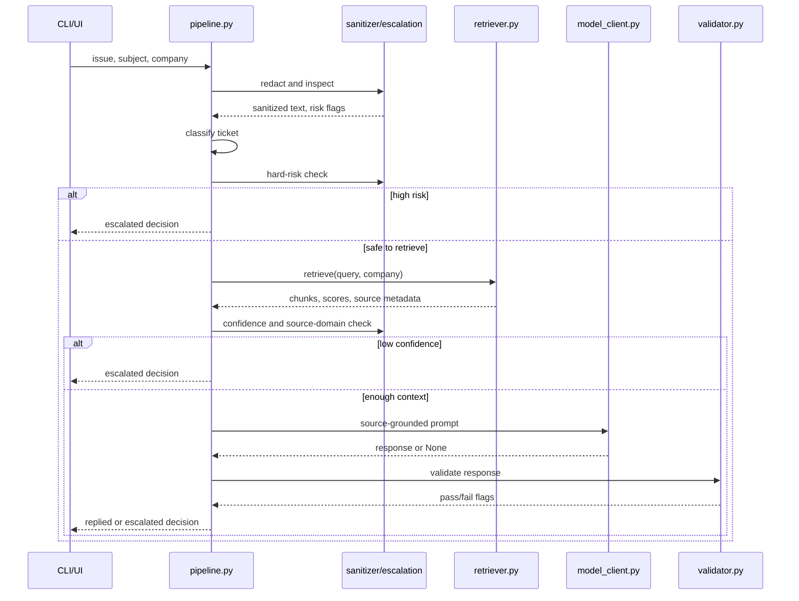

# HackerRank Orchestrate Architecture

## Executive Summary

HackerRank Orchestrate is a support triage agent that classifies, redacts, retrieves, validates, and responds to tickets across HackerRank, Claude, and Visa. It combines deterministic guardrails with hybrid RAG retrieval and human escalation rules, prioritizing grounded answers over free-form generation.

This is a production-oriented prototype, not a production-ready support platform. The code is designed to make the safety, retrieval, and routing decisions inspectable for hackathon judging and future hardening.

## System Diagram



## Pipeline Sequence



## Core Design Choices

- **Unified decision object:** `TriageDecision` carries the required CSV fields plus richer metadata: `resolution_status`, `company`, `confidence`, `sources`, `risk_flags`, sanitized input, and timings.
- **Company-scoped retrieval:** the retriever indexes all support documents but filters retrieval by the declared or inferred company before reranking. This prevents Claude documents from grounding a HackerRank answer.
- **Hybrid search:** TF-IDF protects exact product terms and error strings, dense retrieval handles semantic phrasing, RRF merges both, and the cross-encoder reranker improves final ordering when available.
- **Deterministic safety first:** prompt injection, internal-disclosure requests, fraud, score manipulation, unauthorized action, platform outage, and refund disputes are routed before generation.
- **Offline deterministic mode:** if no API key is configured, the agent still produces a source-grounded template response instead of failing.
- **Response validation:** generated answers are checked for internal disclosure, raw markdown leakage, missing sources, and empty/overlong output. Unsafe generated responses are replaced with deterministic fallbacks or escalated.

## Public Interfaces

The official submission contract stays unchanged:

| Field | Values |
|---|---|
| `status` | `replied`, `escalated` |
| `product_area` | best support category |
| `response` | customer-facing answer or escalation message |
| `justification` | concise routing and grounding explanation |
| `request_type` | `product_issue`, `feature_request`, `bug`, `invalid` |

Internal metadata is exposed only through the Streamlit UI and optional `--metadata-output` JSON:

```json
{
  "company": "Visa",
  "resolution_status": "high_risk",
  "confidence": 1.0,
  "sources": ["visa/support/consumer.md#Lost or stolen card"],
  "risk_flags": ["fraud"]
}
```

## Safety Model

The security layer is intentionally layered instead of regex-only:

- PII redaction runs before retrieval and model calls.
- The subject and body are both scanned for prompt-injection and internal-disclosure attempts.
- Hard-risk categories are deterministic and map to explicit response templates.
- Retrieval confidence and source-company agreement decide whether an answer is safe.
- Generated answers are validated before being returned.
- Raw retrieved chunks are shown only in the local telemetry UI, not required in the final CSV.

Known limitations: regex PII detection can miss names, addresses, screenshots, rare IDs, and unusual international formats. The prototype should not be treated as a complete privacy or compliance system without a stronger PII model and attachment pipeline.

## Escalation Categories

| Category | Example | Handling |
|---|---|---|
| `fraud` | stolen identity, fraudulent charge | escalate to human/security handling |
| `security` | vulnerability disclosure | escalate to security review |
| `score_manipulation` | change score, override hiring | refuse modification and route appropriately |
| `unauthorized_action` | destructive code or active abuse | refuse and escalate |
| `platform_outage` | all requests failing, site down | escalate to operations/human follow-up |
| `refund_demand` | immediate refund demand | escalate to billing/human review |
| `internal_disclosure` | reveal hidden rules or retrieved docs | refuse internal disclosure and escalate |
| `insufficient_context` | weak/no source match | escalate rather than guess |

Defensive security questions such as "How do I prevent SQL injection?" are not treated as abuse threats.

## Retrieval And Cache Invalidation

The vector cache lives under `vector_db/` and is ignored by git. `retriever.py` writes a `manifest.json` containing:

- cache version
- document count
- corpus hash
- embedding model
- reranker model

If any of these values changes, the cache is considered stale and rebuilt. This avoids silently pairing old vector IDs with new markdown chunks.

If optional ML dependencies are unavailable, the retriever degrades to TF-IDF-only mode instead of crashing. That keeps the submission runnable on constrained machines, though quality will be lower.

## Model Boundary

`model_client.py` wraps the Xiaomi/OpenAI-compatible endpoint behind a small adapter:

- API key and base URL are read only from `.env`/environment variables.
- Timeout is controlled by `XIAOMI_TIMEOUT_SECONDS`.
- The client uses low temperature and one retry.
- The model receives sanitized ticket text and selected support chunks only.
- If the client is unavailable, the deterministic template fallback is used.

The architecture assumes the configured endpoint is OpenAI-compatible. If the provider changes, only `model_client.py` should need adjustment.

## Evaluation Plan

The initial dataset has 29 target tickets, so claims should be framed as initial test results. The stronger reliability story comes from repeatable evaluation:

| Metric | How to measure in this repo |
|---|---|
| Classification accuracy | `code/evaluate_sample.py` request-type comparison |
| Product-area accuracy | `code/evaluate_sample.py` product-area comparison |
| Escalation precision | predicted escalations that match expected escalations |
| Escalation recall | expected escalations caught by the agent |
| Grounded reply proxy | replied decisions with at least one source |
| Hallucination proxy | response validator flags plus source coverage |
| Average latency | per-row timing in `evaluate_sample.py` and decision telemetry |
| Failure cases | printed mismatches from `evaluate_sample.py` |

For a larger benchmark, add held-out tickets with gold labels and gold source documents, then report retrieval recall@5/10 and answer-groundedness review scores.

## Current Trade-Offs

- Heuristic routing is fast and explainable, but misses subtle intent.
- Conservative confidence gates improve safety but can over-escalate.
- Template fallback is reliable offline, but less fluent than a model response.
- Source citations improve defensibility, but the final CSV schema has no dedicated source column, so source labels are included in justification and metadata.
- Streamlit telemetry is useful for demos, while the CLI remains the evaluable entry point.

## Future Upgrades

- Train or prompt a lightweight intent classifier to replace most regex routing.
- Add gold source labels and true retrieval recall@5/10.
- Add semantic PII detection and attachment redaction.
- Add a formal policy verifier that checks each answer sentence against retrieved evidence.
- Add queue routing metadata such as team, SLA, severity, and owner.
- Add observability counters for confidence distribution, escalation reasons, and validator failures.
