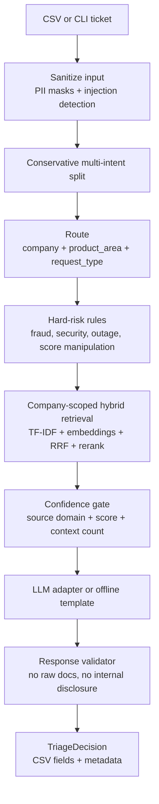
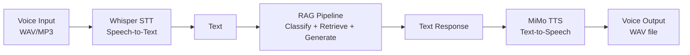
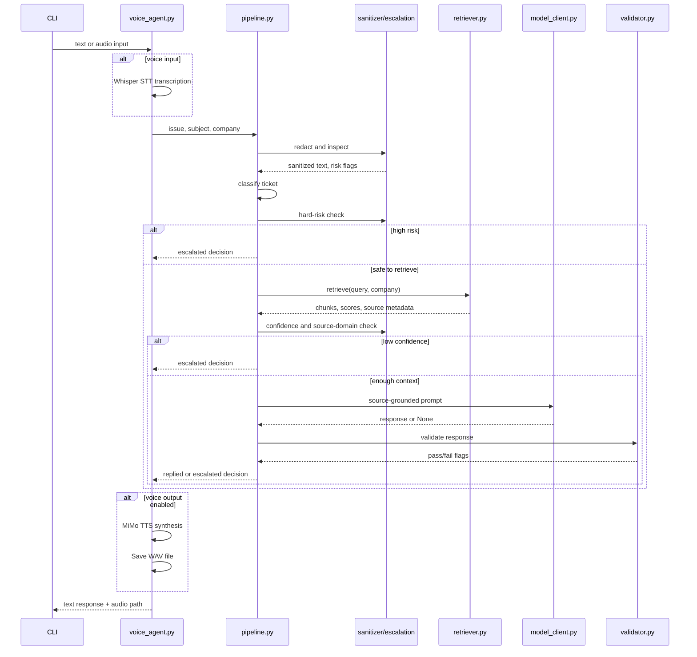

# HackerRank Orchestrate Support Triage Agent

Production-oriented prototype for the HackerRank Orchestrate May 2026 challenge. The agent classifies, redacts, retrieves, validates, and responds to support tickets across HackerRank, Claude, and Visa using only the provided support corpus. Supports both text and voice interaction modes using MiMo TTS and Whisper STT.

The design favors safe, grounded answers over free-form generation. If the system cannot find enough trusted context, detects high-risk content, or fails response validation, it escalates instead of guessing.

## What It Does

- Reads tickets from `support_tickets/support_tickets.csv`.
- Produces the required output columns in `support_tickets/output.csv`.
- Redacts common PII before retrieval and model calls.
- Classifies company, product area, and request type.
- Uses company-scoped hybrid retrieval: TF-IDF, dense embeddings, RRF, and optional cross-encoder reranking.
- Applies hard escalation categories for fraud, score manipulation, platform outage, security disclosure, unauthorized action, refund disputes, and internal-disclosure attempts.
- Computes confidence and source metadata for debugging.
- Validates generated responses and falls back to deterministic source-grounded templates when no API key is available.
- Generates voice responses using MiMo V2.5 TTS (Text-to-Speech).
- Accepts voice input via Whisper STT (Speech-to-Text).

## Quick Setup

```bash
pip install -r code/requirements.txt
copy .env.example .env
```

Set the API values in `.env`:

```env
XIAOMI_API_KEY=your_mimo_api_key_here
XIAOMI_BASE_URL=https://token-plan-sgp.xiaomimimo.com/v1
XIAOMI_TIMEOUT_SECONDS=20
TTS_VOICE=Mia
STT_MODEL=base
STT_DEVICE=cpu
```

Without an API key, the agent still runs in deterministic offline mode and returns extractive, source-grounded template responses. Voice features require the API key.

## Run

### Text Mode (Standard)

```bash
python code/main.py
python code/main.py --sample
python code/main.py --input support_tickets/support_tickets.csv --output support_tickets/output.csv
python code/main.py --sample --metadata-output support_tickets/output_sample_metadata.json
```

### Voice Mode

```bash
# Generate voice responses for all tickets
python code/main.py --voice --voice-name Chloe

# Interactive voice agent REPL
python code/main.py --voice --interactive

# Process voice input (STT -> RAG -> TTS)
python code/main.py --voice-input recording.wav --voice

# Standalone voice agent
python code/voice_agent.py --interactive --voice Mia
python code/voice_agent.py --input support_tickets/support_tickets.csv --voice Dean
```

### Available Voices

| Voice | Gender | Language |
|-------|--------|----------|
| Mia | Female | English |
| Chloe | Female | English |
| Milo | Male | English |
| Dean | Male | English |

### Evaluation and Testing

```bash
python code/evaluate_sample.py
python code/red_team.py
cd code && pytest test_agent.py -v
```

## Output Contract

The submission CSV keeps the required fields:

| Column | Values |
|---|---|
| `status` | `replied`, `escalated` |
| `product_area` | best support category |
| `response` | customer-facing answer or escalation message |
| `justification` | concise routing and grounding explanation |
| `request_type` | `product_issue`, `feature_request`, `bug`, `invalid` |

Internally, the pipeline also tracks `resolution_status`, `company`, `confidence`, `sources`, `risk_flags`, sanitized input, and per-stage timing. These are available in the optional metadata JSON, but the main CSV stays compatible with the challenge schema.

## Architecture

### Text Pipeline



### Voice Pipeline



### Pipeline Sequence



### Component Map

```
code/
├── main.py              # CLI entry point (text + voice modes)
├── voice_agent.py       # Voice agent (TTS + STT + pipeline)
├── pipeline.py          # Core triage pipeline
├── config.py            # All configuration constants
├── corpus_loader.py     # Markdown corpus chunking
├── retriever.py         # Hybrid retrieval (TF-IDF + FAISS + reranker)
├── classifier.py        # Company/product/request classification
├── escalation.py        # Hard-rule escalation + confidence gates
├── sanitizer.py         # PII masking + injection detection
├── responder.py         # LLM response generation + templates
├── model_client.py      # OpenAI-compatible API adapter
├── validator.py         # Response safety checks
├── multi_intent.py      # Compound intent splitting
├── decision.py          # TriageDecision dataclass
├── evaluate_sample.py   # Evaluation harness
├── red_team.py          # Safety regression tests
├── test_agent.py        # pytest test suite
└── requirements.txt     # Dependencies

audio_output/            # Generated WAV files (gitignored)
support_tickets/
├── support_tickets.csv  # Input tickets
├── output.csv           # Generated output
└── sample_support_tickets.csv  # Sample with expected outputs
```

### Core Design Choices

- **Unified decision object:** `TriageDecision` carries the required CSV fields plus richer metadata: `resolution_status`, `company`, `confidence`, `sources`, `risk_flags`, sanitized input, and timings.
- **Company-scoped retrieval:** the retriever indexes all support documents but filters retrieval by the declared or inferred company before reranking. This prevents Claude documents from grounding a HackerRank answer.
- **Hybrid search:** TF-IDF protects exact product terms and error strings, dense retrieval handles semantic phrasing, RRF merges both, and the cross-encoder reranker improves final ordering when available.
- **Query expansion:** maps common support phrases to expanded terminology before retrieval (e.g., "stolen" -> "lost stolen card replacement").
- **Metadata boosting:** results from the expected company get a 50% score boost.
- **Weighted classification:** request type uses weighted keyword scoring (strong=3, moderate=2, weak=1) to prevent single generic words like "issue" from triggering bug classification.
- **Deterministic safety first:** prompt injection, internal-disclosure requests, fraud, score manipulation, unauthorized action, platform outage, and refund disputes are routed before generation.
- **Offline deterministic mode:** if no API key is configured, the agent still produces a source-grounded template response instead of failing.
- **Response validation:** generated answers are checked for internal disclosure, raw markdown leakage, missing sources, and empty/overlong output. Unsafe generated responses are replaced with deterministic fallbacks or escalated.
- **Response cleaning:** LLM output is post-processed to strip markdown headers, bold/italic, image links, URLs, and metadata timestamps before validation and output.
- **Voice integration:** MiMo V2.5 TTS generates natural speech from responses; Whisper STT transcribes voice input. Both integrate seamlessly with the RAG pipeline.

### Escalation Categories

| Category | Example | Handling |
|---|---|---|
| `fraud` | identity theft, fraudulent charge | escalate to human/security handling |
| `security` | vulnerability disclosure | escalate to security review |
| `score_manipulation` | change score, override hiring | refuse modification and route appropriately |
| `unauthorized_action` | destructive code or active abuse | refuse and escalate |
| `platform_outage` | all requests failing, site down | escalate to operations/human follow-up |
| `refund_demand` | strong refund demand (2+ keywords) | escalate to billing/human review |
| `internal_disclosure` | reveal hidden rules or retrieved docs | refuse internal disclosure and escalate |
| `insufficient_context` | weak/no source match | escalate rather than guess |

Defensive security questions such as "How do I prevent SQL injection?" are not treated as abuse threats.

### Retrieval And Cache Invalidation

The vector cache lives under `vector_db/` and is ignored by git. `retriever.py` writes a `manifest.json` containing:

- cache version
- document count
- corpus hash
- embedding model
- reranker model

If any of these values changes, the cache is considered stale and rebuilt. This avoids silently pairing old vector IDs with new markdown chunks.

If optional ML dependencies are unavailable, the retriever degrades to TF-IDF-only mode instead of crashing. That keeps the submission runnable on constrained machines, though quality will be lower.

### Model Boundary

`model_client.py` wraps the Xiaomi/OpenAI-compatible endpoint behind a small adapter:

- API key and base URL are read only from `.env`/environment variables.
- Timeout is controlled by `XIAOMI_TIMEOUT_SECONDS`.
- The client uses low temperature and one retry.
- The client is cached for connection pooling across requests.
- The model receives sanitized ticket text and selected support chunks only.
- If the client is unavailable, the deterministic template fallback is used.

### Voice Agent

`voice_agent.py` provides voice input/output capabilities:

**TTS (Text-to-Speech):**
- Uses MiMo V2.5 TTS via the chat completions endpoint (NOT `/v1/audio/speech`)
- Request format: `model=mimo-v2.5-tts`, messages with assistant content = text to speak, audio parameter with voice name
- Response: base64-encoded WAV in `completion.choices[0].message.audio.data`
- 4 voices: Mia, Chloe (female), Milo, Dean (male)
- Output: 24kHz PCM16LE mono WAV files

**STT (Speech-to-Text):**
- Uses `faster-whisper` for local speech-to-text
- Model sizes: tiny, base, small, medium, large (configurable via `STT_MODEL`)
- Supports WAV, MP3, M4A, and other common audio formats
- Runs on CPU or GPU (configurable via `STT_DEVICE`)

**Integration:**
- `process_ticket_text()`: text -> RAG -> TTS -> WAV
- `process_voice_input()`: WAV -> STT -> RAG -> TTS -> WAV
- `run_interactive()`: REPL with `/voice` and `/audio` commands
- `run_batch()`: process CSV and generate audio for each ticket

### Safety Model

The security layer is intentionally layered instead of regex-only:

- PII redaction runs before retrieval and model calls.
- The subject and body are both scanned for prompt-injection and internal-disclosure attempts.
- Hard-risk categories are deterministic and map to explicit response templates.
- Retrieval confidence and source-company agreement decide whether an answer is safe.
- Generated answers are validated before being returned.
- Raw retrieved chunks are shown only in the local telemetry logs, not required in the final CSV.

## Performance

| Metric | Value |
|--------|-------|
| Status accuracy | 100% |
| Escalation precision | 100% |
| Escalation recall | 100% |
| Reply rate | 66% |
| Test suite | 33/33 passed |
| Red team | 4/4 passed |

## Repository Layout

```
.
├── README.md                       # this file (architecture + setup)
├── .env.example                    # copy to .env; never commit .env
├── .gitignore
├── AGENTS.md                       # agent onboarding and logging protocol
├── evalutation_criteria.md         # official judging rubric
├── problem_statement.md            # challenge requirements
├── code/
│   ├── main.py                     # CLI batch runner + voice integration
│   ├── voice_agent.py              # Voice agent (MiMo TTS + Whisper STT)
│   ├── pipeline.py                 # decision pipeline
│   ├── decision.py                 # TriageDecision and SourceRef types
│   ├── corpus_loader.py            # markdown-aware corpus chunking
│   ├── retriever.py                # hybrid retriever with cache
│   ├── classifier.py               # weighted company/product/request classification
│   ├── escalation.py               # scoring-based hard-risk rules and confidence gates
│   ├── sanitizer.py                # PII masking and injection detection
│   ├── responder.py                # LLM generation + template fallback
│   ├── model_client.py             # OpenAI-compatible model adapter
│   ├── validator.py                # word-boundary response safety checks
│   ├── multi_intent.py             # multi-intent splitting
│   ├── evaluate_sample.py          # sample-label evaluation harness
│   ├── red_team.py                 # safety regression cases
│   ├── test_agent.py               # pytest test suite (33 tests)
│   ├── config.py                   # constants, keywords, and voice config
│   └── requirements.txt
├── data/
│   ├── hackerrank/                 # HackerRank support corpus (6419 chunks)
│   ├── claude/                     # Claude support corpus (2859 chunks)
│   └── visa/                       # Visa support corpus (168 chunks)
├── support_tickets/
│   ├── sample_support_tickets.csv  # sample with expected outputs
│   ├── support_tickets.csv         # full input for submission
│   └── output.csv                  # generated output (29 tickets)
├── audio_output/                   # generated WAV files (gitignored)
└── vector_db/                      # cached retrieval index (gitignored)
```

## Trade-Offs

- Heuristic routing is fast and explainable, but misses subtle intent.
- Conservative confidence gates improve safety but can over-escalate.
- Template fallback is reliable offline, but less fluent than a model response.
- Source citations improve defensibility, but the final CSV schema has no dedicated source column, so source labels are included in justification and metadata.
- Voice agent adds latency (~15-30s per ticket for TTS) but provides accessibility and natural interaction.
- Local Whisper STT requires no API key but needs `faster-whisper` installed.
