# HackerRank Orchestrate Support Triage Agent

Production-oriented prototype for the HackerRank Orchestrate May 2026 challenge. The agent classifies, redacts, retrieves, validates, and responds to support tickets across HackerRank, Claude, and Visa using only the provided support corpus.

The design favors safe, grounded answers over free-form generation. If the system cannot find enough trusted context, detects high-risk content, or fails response validation, it escalates instead of guessing.

## What It Does

- Reads tickets from `support_tickets/support_tickets.csv`.
- Produces the required output columns in `support_tickets/output.csv`.
- Redacts common PII before retrieval and model calls.
- Classifies company, product area, and request type.
- Uses company-scoped hybrid retrieval: TF-IDF, dense embeddings, RRF, and optional cross-encoder reranking.
- Applies hard escalation categories for fraud, score manipulation, platform outage, security disclosure, unauthorized action, refund disputes, and internal-disclosure attempts.
- Computes confidence and source metadata for UI/debugging.
- Validates generated responses and falls back to deterministic source-grounded templates when no API key is available.

## Quick Setup

```bash
pip install -r code/requirements.txt
copy .env.example .env
```

Set the API values in `.env` if you want LLM-generated responses:

```env
XIAOMI_API_KEY=your_xiaomi_api_key_here
XIAOMI_BASE_URL=https://api.xiaomi.com/v1
XIAOMI_TIMEOUT_SECONDS=20
```

Without an API key, the agent still runs in deterministic offline mode and returns extractive, source-grounded template responses.

## Run

```bash
python code/main.py
```

Useful variants:

```bash
python code/main.py --sample
python code/main.py --input support_tickets/support_tickets.csv --output support_tickets/output.csv
python code/main.py --sample --metadata-output support_tickets/output_sample_metadata.json
```

Streamlit demo:

```bash
streamlit run ui.py
```

Evaluation and red-team checks:

```bash
python code/evaluate_sample.py
python code/red_team.py
```

## Output Contract

The submission CSV keeps the required fields:

- `status`
- `product_area`
- `response`
- `justification`
- `request_type`

Internally, the pipeline also tracks `resolution_status`, `company`, `confidence`, `sources`, `risk_flags`, sanitized input, and per-stage timing. These are available in the UI and optional metadata JSON, but the main CSV stays compatible with the challenge schema.

## Architecture Snapshot

```mermaid
flowchart LR
    CSV["CSV ticket"] --> Sanitize["PII redaction and injection checks"]
    Sanitize --> Classify["Company, product area, request type"]
    Classify --> Risk["Hard escalation rules"]
    Risk --> Retrieve["Company-scoped hybrid retrieval"]
    Retrieve --> Confidence["Confidence and source checks"]
    Confidence --> Generate["LLM or deterministic template"]
    Generate --> Validate["Response validator"]
    Validate --> Output["CSV row plus debug metadata"]
```



## Cache Behavior

The vector cache is generated under `vector_db/` and ignored by git. It includes a manifest with:

- corpus hash
- document count
- cache version
- embedding model
- reranker model

If the corpus or model configuration changes, the manifest no longer matches and the retrieval cache rebuilds automatically.

## Repository Layout

- `code/main.py` - CLI batch runner.
- `code/pipeline.py` - decision pipeline and shared UI/CLI adapter.
- `code/decision.py` - unified `TriageDecision` and source metadata.
- `code/retriever.py` - cache-aware hybrid retriever.
- `code/evaluate_sample.py` - sample label evaluation harness.
- `code/red_team.py` - safety regression checks.
- `ui.py` - Streamlit telemetry demo.
- `ARCHITECTURE.md` - architecture, trade-offs, evaluation plan, and diagrams.
